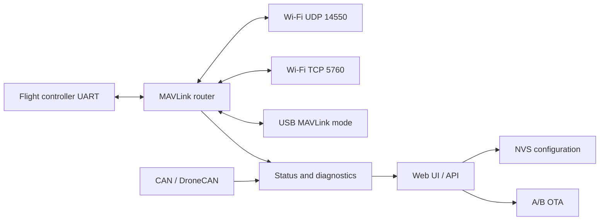

# FlyingRC AirLink C5 Mesh V1

AirLink is an ESP32-C5 telemetry gateway for ArduPilot-compatible flight
controllers. The first release routes MAVLink 1/2 between the flight-controller
UART and Wi-Fi UDP/TCP clients, with a web configuration UI, USB recovery,
rollback-capable OTA and passive DroneCAN diagnostics.
The bilingual single-file UI is deterministically gzip-compressed and embedded
in the application image.

## System overview



### Core functions

- Routes MAVLink 1/2 between the flight-controller UART and Wi-Fi or optional
  USB ground-station endpoints. MAVLink-aware and transparent routing modes are
  available.
- Validates known MAVLink message CRCs, preserves structurally valid custom
  dialect messages, suppresses short-term network reinjection loops and gives
  control/command traffic a dedicated high-priority UART queue.
- Supports AP, STA and AP+STA Wi-Fi modes, up to eight UDP clients and two TCP
  clients. Inactive or stalled clients are reclaimed automatically.
- Serves an authenticated bilingual Web UI for status, configuration, client
  inspection, CAN diagnostics, reboot, factory reset and OTA.
- Stores configuration in CRC-protected, generation-numbered NVS A/B records.
  The factory serial number and initial password use a separate identity
  partition. Blank devices can consume a CRC-protected one-time password record
  written by the cross-platform USB flasher; the record is erased after first use.
- Passively monitors DroneCAN `NodeStatus`, TWAI error counters and bus-off
  recovery. CAN transmission and bitrate switching are enabled only in the
  factory-test build.
- Provides rollback-capable A/B OTA with hardware, image, project-name and
  SHA-256 checks. A new image is confirmed only after a 30-second healthy
  service window.
- Protects configuration changes, reboot, reset, OTA and USB mode changes while
  an armed flight-controller heartbeat is latched.

### Web API

All API routes require HTTP Basic authentication using user `admin` and the
per-board administrator password.

| Method | Route | Function |
| --- | --- | --- |
| `GET` | `/api/v1/status` | Firmware, flight-controller, Wi-Fi, UART, heap and reset status |
| `GET` | `/api/v1/config` | Read the active configuration |
| `PUT` | `/api/v1/config` | Validate and save configuration; reboot required |
| `GET` | `/api/v1/clients` | List active UDP and TCP clients |
| `GET` | `/api/v1/can` | Read TWAI counters and active DroneCAN nodes |
| `POST` | `/api/v1/actions/reboot` | Reboot the device |
| `POST` | `/api/v1/actions/factory-reset` | Restore generated per-board defaults and reboot |
| `POST` | `/api/v1/ota` | Validate, write and activate an OTA application image |

## Hardware target

- Module: `ESP32-C5-WROOM-1U-N8R8` (8 MB flash, 8 MB PSRAM)
- ESP-IDF: exactly 6.0.2 for the first qualified release
- Hardware ID: `airlink-c5-mesh-v1`
- Default AP: `FlyingRC-AirLink-XXXX`, `192.168.4.1`; password is generated per
  device and must be saved by factory test or the cross-platform USB flasher
- MAVLink: UDP 14550, TCP 5760

In AP+STA mode telemetry sockets listen only on the private AirLink AP address;
the upstream STA network is used for connectivity but does not expose flight
control ports. STA-only mode intentionally exposes telemetry to that selected
network and should be used only on a trusted, isolated LAN.

The UART connector silkscreen `5 R T G` is interpreted as AirLink `R` (GPIO23
TX) to flight-controller RX, and AirLink `T` (GPIO24 RX) to flight-controller
TX. See [the complete pinout](docs/PINOUT.md).

> **Power warning:** USB VBUS, UART 5V and CAN 5V may be directly connected on
> the V1 sample. Do not connect more than one 5V source until reverse-current
> protection has been confirmed on the actual schematic and board.

## Build

```sh
source /path/to/esp-idf-v6.0.2/export.sh
idf.py set-target esp32c5
idf.py build
```

Factory-test and recovery variants use additional defaults:

```sh
idf.py -B build-factory -D SDKCONFIG=build-factory/sdkconfig -D SDKCONFIG_DEFAULTS="sdkconfig.defaults;sdkconfig.ci.factory-test" build
idf.py -B build-recovery -D SDKCONFIG=build-recovery/sdkconfig -D SDKCONFIG_DEFAULTS="sdkconfig.defaults;sdkconfig.ci.recovery" build
```

Initial USB flashing requires GPIO27 high and GPIO28 low during reset. Hold
BOOT while powering or resetting the board, then run `idf.py -p PORT flash`.

### Local USB flasher

The `v0.2.1-dev` release includes a single-file local Web Serial flasher for
Windows and macOS. Extract `AirLink-USB-Flasher-v0.2.1-dev.zip`, then run
`start_flasher.bat` on Windows or `start_flasher.command` on macOS. Chrome or
Edge is required; Safari is not supported. The page downloads only the fixed
`v0.2.1-dev` firmware from the matching GitHub tag and accepts it only when the
manifest SHA-256 and GitHub Release digest both match.

The flasher never performs a whole-chip erase and never writes normal NVS or
factory identity. A blank device receives only the one-time password record at
`0x2C000`. Passwords, logs and USB data remain local to the browser.

## Operation

1. Connect to the AP using the per-board password recorded by factory test or
   downloaded from the cross-platform USB flasher.
2. Open <http://192.168.4.1> and sign in as `admin` with the same password.
3. Configure the flight controller UART for MAVLink at the selected baud rate.
4. QGroundControl normally discovers UDP 14550. Mission Planner can use UDP
   14550 or TCP `192.168.4.1:5760`.

USB has one CDC channel. `LOG_CLI` provides logs and recovery commands;
`MAVLINK` provides MAVLink only. Switching mode requires a restart. UART0 test
pads remain the independent rescue log at 115200 baud.

### Runtime and build modes

| Mode | Telemetry | Management behavior |
| --- | --- | --- |
| Release | UART, UDP/TCP and optional USB MAVLink; passive DroneCAN | Normal authenticated Web UI and OTA |
| Recovery | UART and CAN disabled; USB forced to `LOG_CLI` | Wi-Fi and Web recovery access remain available |
| Hardware mismatch | UART and CAN disabled | Web UI is read-only |
| Factory test | Normal interfaces plus test-only CAN TX and BLE advertising | USB CLI exposes identity, UART, CAN, Wi-Fi, LED and BOOT tests |

## Status LEDs

The RGB state machine updates every 500 ms. Pulse patterns alternate between
two brightness levels; they are not smooth fades.

| RGB LED pattern | Meaning |
| --- | --- |
| Blue pulse | Waiting for Wi-Fi to start or connect |
| Solid orange | Wi-Fi is ready, but no flight-controller MAVLink was received in the last 3 seconds |
| Green pulse | Flight-controller MAVLink is being received |
| White blink | OTA upload or flash write is in progress |
| Red blink | Latched error, such as OTA failure or CAN bus-off |
| Solid blue | Connected/test indication; currently used mainly by factory test |
| Solid purple | Reserved mesh indication; not selected by the current automatic state machine |

The separate ACT LED pulses for approximately 20 ms when UART or CAN data is
received, with pulses rate-limited to one every 50 ms. RGB brightness defaults
to 25 percent and is configurable in the Web UI. A red error remains latched
until it is explicitly cleared by factory test or the device restarts.

## FreeRTOS architecture

ESP-IDF's FreeRTOS scheduler is the firmware runtime. Interrupt handlers only
capture hardware events; bounded queues and dedicated tasks perform routing and
protocol work:

- `fc_uart_rx` / `fc_uart_tx`: flight-controller UART ingress and prioritized egress
- `telemetry_net`: UDP discovery/broadcast plus independent TCP client queues
- `usb_mux`: USB Serial/JTAG CLI or MAVLink endpoint
- `can_diag`: TWAI state recovery and passive DroneCAN parsing
- `status_led`, `status`, `ota_confirm`: UI state, health telemetry and OTA validation

The router preserves endpoint identity, uses short-lived frame fingerprints to
stop reinjection loops, and never forwards ground-station input to another
ground-station client. High-priority MAVLink control/command traffic has its own
UART queue; normal traffic drops oldest first under congestion.

## Verification boundaries

Host tests and an ESP-IDF build verify source and build integration. They do
not prove USB signal integrity, RF range, multi-source 5V safety, CAN
termination, transceiver standby wiring or flight performance. Every V1 board
must pass [factory testing](docs/FACTORY_TEST.md) before powered flight tests.

## Security

This development release validates ESP image format, target marker and SHA-256 during OTA but
does not authenticate the publisher. Secure Boot, flash encryption and
irreversible security eFuses are intentionally disabled on the 18 samples.

Licensed under Apache-2.0.
