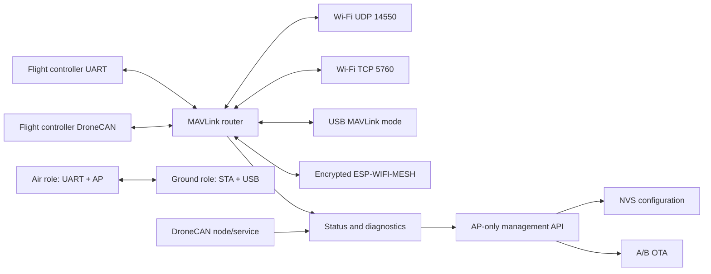

# FlyingRC AirLink C5 Mesh V1

AirLink is an ESP32-C5 telemetry gateway for MAVLink flight controllers.
V0.5 keeps the fixed-root ESP-WIFI-MESH transport introduced in V0.4 for one
ground unit and up to eight airborne UART MAVLink nodes while preserving the
Wi-Fi gateway/bridge and DroneCAN modes. Device management is API-only; no HTML
application is embedded in the firmware.

## System overview



### Core functions

- Runs a 2.4 GHz-only ESP-WIFI-MESH with one fixed ground root, at most eight
  approved airborne nodes and at most three wireless links (ESP-MESH layer 4).
  Airborne nodes never elect themselves root. Every application packet uses
  HKDF-SHA256 separated AES-256-GCM keys and a 64-packet replay window.
- Keeps Mesh configuration and the root approval list in independent
  CRC/generation NVS A/B records, leaving the V0.3.3 schema-v2 record unchanged.
- Exposes Mesh provisioning, approval, topology, two-phase network updates and
  staged OTA through the local USB WebSerial management session. Mesh SoftAP is
  not a general-purpose browser access point.

- Routes MAVLink 1/2 between the flight-controller UART and Wi-Fi or optional
  USB ground-station endpoints. MAVLink-aware and transparent routing modes are
  available.
- Alternatively routes MAVLink bytes through standard
  `uavcan.tunnel.Targetted` as static DroneCAN node `com.flyingrc.airlink`,
  with UART kept disabled in this mode to prevent duplicate command paths.
- Validates known MAVLink message CRCs, preserves structurally valid custom
  dialect messages, suppresses short-term network reinjection loops and gives
  control/command traffic a dedicated high-priority UART queue.
- Supports AP, STA and AP+STA Wi-Fi modes, up to eight UDP clients and two TCP
  clients. Inactive or stalled clients are reclaimed automatically.
- Uses one universal firmware image for gateway, air-bridge and ground-bridge
  roles. The air unit carries flight-controller UART over an authenticated AP;
  the ground unit reconnects as a STA and presents the link as USB MAVLink.
- Serves a page-free management API for status, configuration, client
  inspection, CAN diagnostics, reboot, reset and OTA on the private AP only.
- Stores configuration in CRC-protected, generation-numbered NVS A/B records.
  The factory serial number and initial password use a separate identity
  partition. Blank devices consume a provisioning-v2 serial/password record
  written by the Web Serial flasher. It is erased only after identity and
  active configuration are committed; provisioning v1 remains readable.
- Publishes DroneCAN `NodeStatus`, responds to `GetNodeInfo`, tunnels MAVLink2
  with 120-byte chunks and keepalives, and reports peer, queue and TWAI error
  state. Passive observation and bus-off recovery remain available in UART mode.
- Provides rollback-capable A/B OTA with hardware, image, project-name and
  SHA-256 checks. A new image is confirmed only after a 30-second healthy
  service window.
- Protects configuration changes, reboot, reset, OTA and USB mode changes while
  an armed flight-controller heartbeat is latched.

### Management API v2

Management is accepted only on `192.168.4.1`, the private AirLink AP address.
STA interfaces expose telemetry only. A client opens a challenge with a random
client nonce, proves knowledge of the administrator password, then signs each
request with a derived temporary key, increasing counter and body SHA-256.
Sessions expire after ten idle minutes; passwords and Mesh fleet keys are never
returned.

| Method | Route | Function |
| --- | --- | --- |
| `POST` | `/api/v2/session/challenge`, `/api/v2/session/auth` | Establish a temporary authenticated session |
| `GET` | `/api/v2/capabilities`, `/api/v2/status` | Capabilities and runtime status |
| `GET/PUT` | `/api/v2/config` | Read non-secret settings or atomically save validated settings |
| `POST` | `/api/v2/config/validate`, `/api/v2/wifi/scan` | Validate without saving or scan networks |
| `GET` | `/api/v2/clients`, `/api/v2/can`, `/api/v2/diagnostics` | Runtime diagnostics |
| `POST` | `/api/v2/reboot`, `/api/v2/reset`, `/api/v2/ota` | Disarmed-only maintenance actions |

## Hardware target

- Module: `ESP32-C5-WROOM-1U-N8R8` (8 MB flash, 8 MB PSRAM)
- ESP-IDF: exactly 6.0.2 for the first qualified release
- Hardware ID: `airlink-c5-mesh-v1`
- Default AP: `FlyingRC-AirLink-XXXX`, `192.168.4.1`; password is generated per
  device and must be saved from the cross-platform USB flasher
- MAVLink: UDP 14550, TCP 5760

In AP+STA mode telemetry sockets listen only on the private AirLink AP address;
the upstream STA network is used for connectivity but does not expose flight
control ports. STA-only mode intentionally exposes telemetry to that selected
network and should be used only on a trusted, isolated LAN.

The UART connector silkscreen `5 R T G` is interpreted as AirLink `R` (GPIO23
TX) to flight-controller RX, and AirLink `T` (GPIO24 RX) to flight-controller
TX. See [the complete pinout](docs/PINOUT.md).

> **Power warning:** USB VBUS, UART 5V and CAN 5V may be directly connected on
> the V1 sample. Do not connect more than one 5V source until reverse-current
> protection has been confirmed on the actual schematic and board.

## Build

```sh
source /path/to/esp-idf-v6.0.2/export.sh
idf.py set-target esp32c5
idf.py build
```

The recovery variant uses an additional default:

```sh
idf.py -B build-recovery -D SDKCONFIG=build-recovery/sdkconfig -D SDKCONFIG_DEFAULTS="sdkconfig.defaults;sdkconfig.ci.recovery" build
```

Initial USB flashing requires GPIO27 high and GPIO28 low during reset. Hold
BOOT while powering or resetting the board, then run `idf.py -p PORT flash`.

### Local USB flasher

The `v0.5.0-dev` release includes a single-file local Web Serial flasher for
Windows and macOS. Extract `AirLink-USB-Flasher-v0.5.0-dev.zip`, then run
`start_flasher.bat` on Windows or `start_flasher.command` on macOS. Chrome or
Edge is required; Safari is not supported. The page downloads only the fixed
`v0.5.0-dev` firmware from the matching GitHub tag and accepts it only when the
manifest SHA-256 and GitHub Release digest both match.

The flasher never performs a whole-chip erase and never writes normal NVS or
permanent identity. A blank device receives a provisioning-v2 record containing
the entered serial number and initial password at `0x2C000`. Passwords, logs
and USB data remain local to the browser.

### AirLink-GS management

Configuration, diagnostics and upgrades are provided by the separate
AirLink-GS desktop application. USB settings use the transaction-based text
CLI; Wi-Fi settings use management API v2 through the private AirLink AP.
The byte-level contract for both interfaces is documented in
[management protocols](docs/MANAGEMENT_PROTOCOLS.md).

On a Mesh ground root, sending `+++AIRLINK-CLI\r\n` enters the COBS-framed
binary management session and temporarily pauses the USB MAVLink endpoint. A
close frame, serial disconnect, 60-second idle timeout or reboot restores USB
MAVLink. See [Mesh operation and recovery](docs/MESH.md).

## Operation

1. Connect to the AP using the per-board password downloaded from the flasher.
2. Open AirLink-GS and connect over USB or the private AP.
3. Configure the flight controller UART for MAVLink at the selected baud rate.
4. QGroundControl normally discovers UDP 14550. Mission Planner can use UDP
   14550 or TCP `192.168.4.1:5760`.

USB has one CDC channel. `LOG_CLI` provides logs and recovery commands;
`MAVLINK` provides MAVLink only. Switching mode requires a restart. UART0 test
pads remain the independent rescue log at 115200 baud.

### USB configuration CLI

Release firmware can be configured and diagnosed locally over the USB
`LOG_CLI`; Wi-Fi access is not required. Run `status` to read flight-controller,
UART and Wi-Fi link counters, `config show` to read the active settings and
`config help` to list every writable key. For example:

```text
config begin
config stage uart_baud 115200
config stage route_mode mavlink
config stage wifi_mode ap
config stage wifi_band 2g
config stage udp_port 14550
config stage tcp_port 5760
config stage bridge_role off
config validate
config commit
reboot
```

The transaction is held only in RAM until `config commit`; validation failure,
timeout, disconnect or `config abort` leaves the active configuration unchanged.
Only `config commit` and `config reset` write the CRC-protected NVS A/B records.
New settings take effect after `reboot`.
Configuration writes and reboot remain
blocked while an armed flight-controller heartbeat is latched. `config show`
includes credentials because USB is treated as a local physical management
interface; protect physical access to deployed devices.

### Crash logs and collection

Release firmware stores panic and task-watchdog coredumps, including the ESP-IDF
log ring, in the dedicated flash partition at `0x630000`. `status` and the
management API report `coredump_present`, `coredump_size`, `previous_boot_stage`
and `boot_stage`. Boot-stage breadcrumbs are persisted without credentials so a
subsequent physical restart can show which service was last reached. Routine
`ESP_LOG` output remains live-only on USB `LOG_CLI` and the independent UART0
test pads; the reserved diagnostics filesystem is not used for continuous log
writes, avoiding flash wear and accidental credential retention.

Capture a responsive device without changing flash:

```powershell
python tools/collect_crash_diagnostics.py --port COM14
```

To preserve and decode a coredump, use the matching build ELF and request the
bounded downloader window:

```powershell
python tools/collect_crash_diagnostics.py --port COM14 --read-coredump --open-downloader --elf build-release/airlink.elf
```

If USB is enumerated but the application cannot accept commands, hold BOOT while
reconnecting the module and replace `--open-downloader` with
`--bootloader-ready`. Reports are written below ignored `diagnostic-reports/`,
redact password/token-shaped text, and never erase the coredump.

### Two-AirLink wireless bridge

Both units run the same firmware. Configure the unit attached to the flight
controller as the air side:

```text
config begin
config stage route_mode mavlink
config stage wifi_band 2g
config stage bridge_role air
config validate
config commit
reboot
```

On the USB-attached ground unit, copy the air unit's AP SSID and password, then
select the ground role:

```text
config begin
config stage sta_ssid AIR_UNIT_SSID
config stage sta_password AIR_UNIT_PASSWORD
config stage wifi_band 2g
config stage bridge_role ground
config validate
config commit
reboot
```

Selecting `air` automatically selects Wi-Fi AP plus USB `LOG_CLI`; selecting
`ground` selects Wi-Fi STA plus USB MAVLink. AirLink-GS exposes the same role
selector. In ground mode, writing the exact
ASCII sequence `+++AIRLINK-CLI\r\n` to USB temporarily switches that boot into
the local CLI; reboot restores the configured USB MAVLink mode.

For repeatable post-update acceptance, run the two-unit automation with the
air-side and ground-side USB ports. `--pair` is optional and atomically copies
the air AP credentials into the ground unit without printing or persisting the
password on the host. `--reconnect` deliberately reboots the air unit and
requires telemetry to recover within the configured timeout.

```powershell
python tools/wifi_bridge_acceptance.py --air-port COM14 --ground-port COM20 --pair --reconnect --json-out diagnostic-reports/bridge.json
```

The command exits nonzero on version/role mismatch, no valid heartbeat,
incomplete or CRC-invalid parameter transfer, any queue/overflow counter above
the configured limit, or failed automatic reconnect. Omit `--pair` after the
units are paired; use `--max-queue-drops N` only when deliberately qualifying a
documented nonzero limit.

### Runtime and build modes

| Mode | Telemetry | Management behavior |
| --- | --- | --- |
| Release | UART, UDP/TCP and optional USB MAVLink; passive DroneCAN | AP-only authenticated API and OTA |
| Recovery | UART and CAN disabled; USB forced to `LOG_CLI` | AP-only recovery API remains available |
| Hardware mismatch | UART and CAN disabled | Management API is read-only |

## Status LEDs

The RGB state machine updates every 500 ms. Pulse patterns alternate between
two brightness levels; they are not smooth fades.

| RGB LED pattern | Meaning |
| --- | --- |
| Blue pulse | Waiting for Wi-Fi to start or connect |
| Solid orange | Wi-Fi is ready, but no flight-controller MAVLink was received in the last 3 seconds |
| Green pulse | Flight-controller MAVLink is being received |
| White blink | OTA upload or flash write is in progress |
| Red blink | Latched error, such as OTA failure or CAN bus-off |
| Solid blue | Connected or explicit service indication |
| Solid purple | Reserved mesh indication; not selected by the current automatic state machine |

The separate ACT LED pulses for approximately 20 ms when UART or CAN data is
received, with pulses rate-limited to one every 50 ms. RGB brightness defaults
to 25 percent and is configurable through `config` or AirLink-GS. A red error remains latched
until the device restarts.

## FreeRTOS architecture

ESP-IDF's FreeRTOS scheduler is the firmware runtime. Interrupt handlers only
capture hardware events; bounded queues and dedicated tasks perform routing and
protocol work:

- `fc_uart_rx` / `fc_uart_tx`: flight-controller UART ingress and prioritized egress
- `telemetry_net`: UDP discovery/broadcast plus independent TCP client queues
- `usb_mux`: USB Serial/JTAG CLI or MAVLink endpoint
- `can_diag`: TWAI state recovery and passive DroneCAN parsing
- `status_led`, `status`, `ota_confirm`: UI state, health telemetry and OTA validation

The router preserves endpoint identity, uses short-lived frame fingerprints to
stop reinjection loops, and never forwards ground-station input to another
ground-station client. High-priority MAVLink control/command traffic has its own
UART queue; normal traffic drops oldest first under congestion.

## Verification boundaries

Host tests and an ESP-IDF build verify source and build integration. They do
not prove USB signal integrity, RF range, multi-source 5V safety, CAN
termination, transceiver standby wiring or flight performance. Every V1 board
must pass the external production and bench checks in
[the acceptance guide](docs/ACCEPTANCE.md) before powered flight tests.

## Security

This development release validates ESP image format, target marker and SHA-256 during OTA but
does not authenticate the publisher. Secure Boot, flash encryption and
irreversible security eFuses are intentionally disabled on the 18 samples.

Licensed under Apache-2.0.
